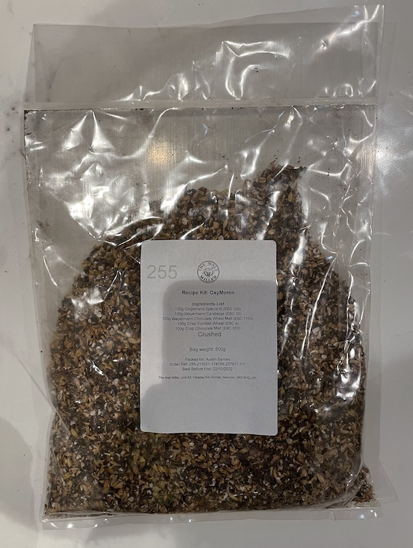

# OxyMoron

## Ingredients

For a 25 litre batch, as at [Malt Miller](https://www.themaltmiller.co.uk/rg/?id=226090)

| Grain                          | Quantity |
| ------------------------------ | -------- |
| Dingemans Special B            | 100g     |
| Weyermann Carabelge            | 100g     |
| Weyermann Chocolate Wheat Malt | 100g     |
| Crisp Torrified Wheat          | 100g     |
| Crisp Chocolate Malt           | 100g     |

From [Grainfather](https://shop.grainfather.com/brewing-calculators)

* Mash water: 13 litres
* Sparge water: 1 litres

| Additions                              | Quantity | Time         |
| -------------------------------------- | -------- | ------------ |
| Celeia (Styrian Goldings) Pellets      | 10g      | 30           |
| Belgian Candi sugar rocks dark         | 50g      | 20           |
| Saaz hops                              | 10g      | 10           |
| Mangrove Jacks Belgian Abbey M47 Yeast |          | Fermentation |
| NBS Clarity                            | 0.25ml   | Fermentation |

## Estimates

From [brewers friend](https://www.brewersfriend.com)

| OG    | FG    | Calories     | Carbs         | ABV  | IBU  | SRM  | 
| ----- | ----- | ------------ | ------------- |---- | ---- | ---- | 
| 1.009 | 1.002 | 28 per 330ml | 26g per 350ml | 0.9% | 18   | 31   | 

## Process

This is a very experimental beer. I've been reading about how to make one that's alcohol free. One method is to boil the alcohol off, which will affect the taste. Another method is to simply brew with a reduced amount of fermentables to ensure the beer will never reach a high strength. The only trouble with this method is getting enough flavour into the beer. This is why it's an experiment.

I'm also experimenting with [NBS Clarity](https://www.themaltmiller.co.uk/product/nbs-clarity-15ml/). In theory adding this at the same time as the yeast will use a magical enzyme to break down gluten haze, which also has the advantage of severely reduced to gluten content to the point where it should be acceptable to Celiacs.

Although I didn't need much water to mash (according to the calculators) i needed a certain amount to cover the grain in the tube. Thus the grain had a lot of freedom to move around and so I'd expect a highly efficient mash.

## Fermentation

Fermentation and gluten removal were combined. Due to winter coming whilst I was away the temperature control wasn't very good.

## Actual figures

| Field       | Target         | Actual |
| ----------- | ------------- | ---------- |
| OG          | 1.09      |1.08|
| FG          | 1.02      |1.05|
| ABV         | 0.9%    |0.4%|
| Attenuation | 75%     |37%|

## Graph

## Barrelling

During siphoning to a barrel the beer lacked mouthfeel. As a third experiment 50g of lactose sugar was added.

## Lessons learnt

* Making a thin beer taste like beer is hard.
* Waiting to test the gluten enzyme on a guinea pig...

